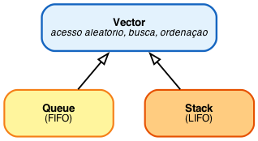

**Repositório (código-fonte, figuras e materiais complementares):** <https://github.com/iurileao-hub/fiap-aurora-siger-fase2>

## Resumo

Este relatório documenta o projeto do **Módulo de Gerenciamento de Pouso e Estabilização de Base (MGPEB)** da missão Aurora Siger, primeira colônia humana em Marte. O MGPEB organiza a sequência de pousos de doze módulos críticos, autoriza ou bloqueia cada operação com base em regras lógicas formais e mantém registros auditáveis de toda decisão automatizada. O sistema foi prototipado em Python com estruturas lineares (filas, vetores, pilhas), algoritmos clássicos de busca e ordenação, e funções matemáticas elementares para modelar fenômenos do pouso. Além da especificação técnica, o relatório contextualiza o sistema na evolução histórica da computação e o articula sob a perspectiva de governança ambiental, social e corporativa (ESG).

---

## 1. Introdução

A missão Aurora Siger prevê o pouso sequencial de doze módulos pré-fabricados que, juntos, constituem a infraestrutura mínima de uma colônia humana em Marte: comando e controle, suporte de vida, habitação, geração de energia, comunicações, suporte médico, produção de alimentos, logística, extração de recursos locais, oficina e laboratório científico. Cada módulo entra em órbita marciana num horário estimado distinto, carrega cargas de criticidade variável e depende de janelas atmosféricas estreitas para descer com segurança. Coordenar essa sequência manualmente é inviável: o atraso de comunicação entre Terra e Marte chega a vinte e quatro minutos por sentido, e a fase de pouso dura poucos minutos.

O MGPEB é o sistema embarcado responsável por essa coordenação. Suas três funções centrais são (i) **organizar** a fila de módulos aguardando autorização de pouso e reordená-la conforme critérios operacionais; (ii) **decidir** se cada módulo está autorizado a descer, com base em uma expressão booleana inspecionável que considera combustível, condições atmosféricas, disponibilidade da zona de pouso, integridade dos sensores e estado de emergência; e (iii) **registrar** cada decisão automatizada de bloqueio numa pilha auditável, garantindo rastreabilidade.

Este documento apresenta o projeto em seis seções e um anexo. A **Seção 2** descreve o cenário e os módulos. A **Seção 3** formaliza as regras de decisão como expressão booleana e apresenta o diagrama de portas lógicas. A **Seção 4** apresenta as funções matemáticas que modelam fenômenos do pouso. A **Seção 5** contextualiza o sistema na evolução da computação. A **Seção 6** desenvolve a reflexão ESG. O **Anexo A** documenta as estruturas de dados do protótipo, com exemplos. O código-fonte completo encontra-se em `mgpeb.py`, executável com `python3 mgpeb.py` sem dependências externas.

---

## 2. Cenário operacional e modelagem dos módulos

### 2.1 Os doze módulos da colônia

A colônia Aurora Siger é composta por doze módulos pré-fabricados, cada um responsável por uma função essencial à habitabilidade da base. A Tabela 1 resume os atributos estáticos de cada módulo — identificador, nome, tipo, prioridade de missão, criticidade da carga e massa. Os atributos variáveis (combustível, integridade dos sensores, distância e velocidade orbitais) são sorteados a cada execução do simulador para refletir a incerteza operacional inerente a uma missão real.

| ID | Nome | Tipo | Prioridade | Criticidade | Massa (kg) |
|---:|------|------|:---:|:---:|---:|
| 1 | Comando e Controle | command | 1 | 5 | 12 000 |
| 2 | Suporte de Vida (ECLSS) | life_support | 2 | 5 | 15 000 |
| 3 | Habitação | habitat | 3 | 4 | 18 000 |
| 4 | Energia Solar | solar | 4 | 5 | 8 000 |
| 5 | Energia Nuclear | nuclear | 5 | 5 | 22 000 |
| 6 | Comunicações | comms | 6 | 4 | 6 000 |
| 7 | Suporte Médico | medical | 7 | 4 | 10 000 |
| 8 | Produção de Alimentos | food | 8 | 3 | 14 000 |
| 9 | Logística e Armazenamento | logistics | 9 | 3 | 25 000 |
| 10 | ISRU (Recursos Locais) | isru | 10 | 2 | 20 000 |
| 11 | Oficina e Manutenção | workshop | 11 | 2 | 16 000 |
| 12 | Laboratório Científico | lab | 12 | 2 | 12 000 |

*Tabela 1 — Atributos estáticos dos doze módulos da Aurora Siger.*

A ordem de prioridade reflete uma hierarquia operacional discutida em detalhe na Seção 6 (ESG): comando e suporte de vida descem primeiro, seguidos por habitação e geração de energia, e somente depois pelos módulos científicos e de manutenção. A criticidade da carga é independente da prioridade — corresponde a um fator de risco em caso de falha (1 = baixo, 5 = catastrófico) e também aciona o *bypass* de emergência discutido na Seção 3.

### 2.2 Atributos operacionais e ETA derivado

Cada módulo é instanciado a partir da classe `Module` (`mgpeb.py`, linhas 40–109) e carrega onze atributos: `id`, `name`, `type`, `priority`, `fuel_level` (%), `mass` (kg), `cargo_criticality` (1–5), `distance` (km — distância orbital de aproximação), `speed` (km/h — velocidade de aproximação), `sensors_ok` (booleano) e `status` (`queued`, `landed` ou `waiting`).

O **horário estimado de chegada (ETA)** não é armazenado como atributo independente: é calculado dinamicamente como `eta = distance / speed`, exposto via `@property`. Essa decisão de design garante que qualquer alteração nas variáveis de aproximação propague-se automaticamente para o ETA, eliminando o risco de inconsistências entre dados redundantes. O ETA é apresentado em formato `HH:MM` com offset a partir de uma hora de início de missão (06:00).

### 2.3 Cenário ambiental

Além dos atributos de módulo, o sistema mantém duas variáveis globais que descrevem o estado ambiental:

- `atmosphere_ok` — condições atmosféricas favoráveis ao pouso (vento, visibilidade, ausência de tempestade de poeira). Probabilidade inicial de 70%, refletindo a alta volatilidade da atmosfera marciana.
- `landing_zone_free` — disponibilidade da zona de pouso. Probabilidade inicial de 90%, refletindo o bom planejamento orbital habitual.

Essas variáveis e os atributos voláteis dos módulos são reinicializados a cada execução pela função `randomize_scenario()`, de modo que cada simulação corresponde a um cenário operacional distinto. O operador pode também sobrescrever manualmente qualquer variável pelo menu interativo (opções 7 e 8 do menu principal).

### 2.4 Estruturas lineares: o papel de cada uma

O MGPEB organiza seu estado em quatro estruturas lineares distintas, cada uma escolhida pelo invariante de acesso adequado à sua função:

- **`landing_queue`** (`Queue`, FIFO) — fila principal de módulos aguardando autorização. A política FIFO é reordenada antes da simulação por critério multivariado (ETA → combustível → prioridade), garantindo que o módulo com menor ETA desça primeiro, com desempate por urgência de combustível e, em última instância, prioridade de missão.
- **`landed_modules`** (`Vector`) — registro dos módulos já pousados com sucesso. Vetor permite consulta indexada e iteração sem restringir o ponto de inserção, adequado a uma estrutura terminal.
- **`waiting_modules`** (`Vector`) — registro dos módulos com pouso adiado. Mesma justificativa do anterior, mantendo simetria estrutural.
- **`alert_stack`** (`Stack`, LIFO) — pilha de alertas gerados a cada bloqueio de pouso. A política LIFO é deliberada: ao consultar a pilha, o operador vê primeiro os bloqueios mais recentes, seguindo a lógica *most-recent-first* típica de sistemas de monitoramento.

A documentação completa das três classes (`Vector`, `Queue` e `Stack`), incluindo métodos, complexidade algorítmica e exemplos de uso, encontra-se no Anexo A.

---

## 3. Regras de decisão e portas lógicas

### 3.1 Variáveis booleanas

A autorização de pouso de cada módulo depende de cinco variáveis booleanas, derivadas dos atributos do módulo e do estado ambiental:

| Símbolo | Variável | Origem | Significado |
|:---:|---|---|---|
| **F** | `fuel_ok` | `module.fuel_level >= 20` | Combustível suficiente para descida controlada |
| **A** | `atmosphere_ok` | `landing_conditions["atmosphere_ok"]` | Atmosfera favorável (vento, visibilidade, sem tempestade) |
| **L** | `zone_free` | `landing_conditions["landing_zone_free"]` | Zona de pouso disponível |
| **E** | `emergency` | `module.cargo_criticality == 5` | Carga de criticidade máxima — *bypass* de zona ocupada |
| **S** | `sensors_ok` | `module.sensors_ok` | Sensores de bordo íntegros |

*Tabela 2 — Variáveis booleanas do MGPEB.*

### 3.2 Expressão lógica de autorização

A regra de autorização combina as cinco variáveis na seguinte expressão booleana (`mgpeb.py`, linha 438):

$$\text{AUTORIZADO} = F \wedge A \wedge (L \vee E) \wedge S$$

Em palavras: o pouso é autorizado **se e somente se** houver combustível suficiente, atmosfera favorável e sensores íntegros, e ainda que ou a zona de pouso esteja livre, ou se trate de uma emergência.

A subexpressão $(L \vee E)$ é o ponto sutil da regra: ela permite que módulos de criticidade máxima (suporte de vida, comando, energia) desçam mesmo com a zona ocupada, sob a premissa de que o custo de adiar a descida supera o de aceitar a sobreposição. Para todas as demais variáveis, a regra é estritamente conjuntiva — qualquer falha bloqueia o pouso.

### 3.3 Diagrama de portas lógicas

A Figura 1 representa graficamente a expressão de autorização como um circuito de portas lógicas. As cinco variáveis de entrada alimentam diretamente uma porta `AND` final, exceto `L` e `E`, que primeiro passam por uma porta `OR` cuja saída entra no `AND`.

{ width=80% }

### 3.4 Tabela-verdade da subexpressão crítica

A subexpressão $(L \vee E)$ é a única não trivial da regra. Sua tabela-verdade (Tabela 3) explicita o efeito do *bypass* de emergência: o pouso só é bloqueado por zona ocupada quando a carga não é crítica.

| L | E | $L \vee E$ | Interpretação |
|:---:|:---:|:---:|---|
| 0 | 0 | 0 | Zona ocupada e carga não-crítica → bloqueado |
| 0 | 1 | 1 | Zona ocupada mas emergência → autorizado |
| 1 | 0 | 1 | Zona livre → autorizado |
| 1 | 1 | 1 | Zona livre e emergência → autorizado |

*Tabela 3 — Tabela-verdade da subexpressão $(L \vee E)$.*

### 3.5 Registro automático de bloqueios

Sempre que `AUTORIZADO = 0`, o sistema empilha um alerta na `alert_stack` contendo identificador do módulo, motivo (concatenação dos predicados violados) e timestamp do ETA. A pilha pode ser inspecionada a qualquer momento via menu (opção 5), exibindo do alerta mais recente para o mais antigo. Esse mecanismo realiza, no protótipo, o princípio de auditabilidade por construção desenvolvido na Seção 6.

A escolha de uma expressão booleana inspecionável — em vez de um classificador estatístico — é deliberada: o operador pode reconstruir a decisão a partir da tabela-verdade e da inspeção dos atributos do módulo, sem opacidade algorítmica. A análise dessa escolha sob a perspectiva arquitetural está na Seção 5; sob a perspectiva ESG, na Seção 6.

---

## 4. Modelagem matemática dos fenômenos do pouso

O MGPEB se apoia em quatro funções matemáticas que descrevem fenômenos físicos e operacionais relevantes para o pouso e a estabilização da base. Cada função foi escolhida para representar uma classe matemática distinta — quadrática, exponencial, parábola invertida e senoidal — articulando-se diretamente com decisões de engenharia do sistema.

Os gráficos a seguir foram gerados pelo script `figuras/gerar_graficos.py` a partir das mesmas implementações usadas pelo protótipo (`mgpeb.py`, linhas 466–538), garantindo consistência entre relatório e código executável.

### 4.1 Altitude de descida — função quadrática

$$h(t) = h_0 - v_0 \cdot t - \tfrac{1}{2} \cdot a \cdot t^2$$

**Parâmetros padrão:** $h_0 = 2000$ m (altitude inicial), $v_0 = 80$ m/s (velocidade inicial de descida), $a = 3{,}7$ m/s² (gravidade marciana).

A queda é uniformemente acelerada (derivada $h'(t) = -v_0 - a \cdot t$); a gravidade marciana — 38% da terrestre — alonga o intervalo de descida em relação à Terra (≈14 s para a mesma queda), oferecendo janela maior para correções de trajetória. O impacto ocorreria em $t \approx 17{,}7$ s sem frenagem (Figura 2a). No MGPEB, dado um limiar de altitude segura $h_{\text{seg}}$, a raiz da equação $h(t^*) = h_{\text{seg}}$ é o tempo $t^*$ em que a manobra de frenagem deve iniciar — pré-condição para integrar o sistema com qualquer subsistema de controle de descida.

### 4.2 Consumo de combustível — função exponencial

$$C(v) = C_0 \cdot e^{k \cdot v}$$

**Parâmetros padrão:** $C_0 = 10$ kg/s (consumo base), $k = 0{,}02$ (coeficiente de crescimento).

\begin{figure}[h]
\centering
\begin{subfigure}{0.48\textwidth}
\includegraphics[width=\textwidth]{figuras/func_altitude.png}
\caption{Altitude de descida sob gravidade marciana ($h_0=2000$\,m, $v_0=80$\,m/s).}
\end{subfigure}
\hfill
\begin{subfigure}{0.48\textwidth}
\includegraphics[width=\textwidth]{figuras/func_combustivel.png}
\caption{Consumo de combustível em função da velocidade de frenagem.}
\end{subfigure}
\caption*{Figura 2 — Funções da fase de descida: altitude (a) e custo de frenagem (b).}
\end{figure}

O consumo dobra a cada incremento fixo de $\ln(2)/k \approx 35$ m/s — frear de 200 m/s consome 546 kg/s, contra 73,9 kg/s a 100 m/s (Figura 2b). Essa penalidade não-linear justifica a preferência por aproximações graduais e fundamenta, junto com a Seção 4.1, a regra heurística: acionar retrofoguetes cedo o bastante para frear de modo gradual, em vez de tarde com frenagem catastroficamente cara.

### 4.3 Geração de energia solar — parábola invertida

$$E(t) = -a \cdot (t - t_{\text{meio}})^2 + E_{\max}$$

**Parâmetros padrão:** $a = 15{,}0$ (coeficiente de abertura), $t_{\text{meio}} = 12{,}3$ h (hora do pico solar), $E_{\max} = 2200$ W (geração máxima). O domínio é truncado em zero para refletir a ausência de geração noturna.

A parábola é simétrica em torno do pico ao meio-dia marciano (Figura 3a): a área sob a curva determina a capacidade diária; o pico, o instante de operações de maior consumo elétrico. A função também explicita a vulnerabilidade da colônia a tempestades de poeira — uma redução prolongada de $E_{\max}$ ameaça toda a operação solar, justificando a redundância nuclear discutida na Seção 6.

### 4.4 Temperatura superficial — função senoidal

$$T(t) = T_{\text{média}} + A \cdot \sin\!\left(\frac{2\pi \cdot t}{P} - \varphi\right)$$

**Parâmetros padrão:** $T_{\text{média}} = -60$ °C, $A = 40$ °C (amplitude), $P = 24{,}62$ h (duração de um sol marciano), $\varphi = 0$ (fase).

\begin{figure}[h]
\centering
\begin{subfigure}{0.48\textwidth}
\includegraphics[width=\textwidth]{figuras/func_solar.png}
\caption{Geração de energia solar (pico de 2200 W ao meio-dia).}
\end{subfigure}
\hfill
\begin{subfigure}{0.48\textwidth}
\includegraphics[width=\textwidth]{figuras/func_temperatura.png}
\caption{Temperatura superficial (média de $-60$\,°C, amplitude de 40\,°C).}
\end{subfigure}
\caption*{Figura 3 — Variáveis ambientais ao longo de um sol marciano (\textasciitilde 24,6 h).}
\end{figure}

Oscilação periódica com período igual ao sol marciano (Figura 3b); com $\varphi = 0$, os extremos ocorrem em $t = P/4$ (máximo) e $t = 3P/4$ (mínimo) — simplificação didática que pode ser ajustada para o pico ao meio-dia local com $\varphi = 2\pi \cdot 12{,}3 / P - \pi/2$. A amplitude de 40 °C com média de −60 °C impõe estresse térmico constante a estruturas, sensores e baterias. No MGPEB, a função ajuda a evitar pousos no pico térmico negativo e, combinada com a Seção 4.3, define a janela ótima de operações por sol — tipicamente entre o início da geração solar significativa e o pico térmico positivo.

---

## 5. Contextualização histórica e arquitetural

*Quando a limitação é o que torna o sinal limpo*

O processador que conduziria o pouso dos módulos da Aurora Siger em Marte seria mais lento que o smartphone de qualquer membro da colônia. O RAD750 — chip *radiation-hardened* (endurecido contra radiação) usado pela *National Aeronautics and Space Administration* (NASA) em diversas missões até o atual rover [Perseverance](https://science.nasa.gov/mission/mars-2020-perseverance/) — opera a até 200 MHz, ordem de grandeza abaixo de processadores comerciais modernos. Lê-se aqui, à primeira vista, uma limitação. Mas a leitura precisa girar: o que parece atraso é a manifestação explícita de uma hierarquia de valores que sistemas críticos terrestres já carregam — controle de tráfego aéreo, marca-passos, unidades de controle automotivas — e que o excesso de recurso na Terra disfarça.

Esta seção argumenta que a computação tem uma base lógica formal que torna a *função* independente do substrato físico, mas suas *propriedades não-funcionais* — energia, calor, falhas, radiação — permanecem radicalmente acopladas ao substrato. Essa dupla natureza é o que torna possível e necessário hierarquizar valores no projeto de sistemas. Quando o substrato é hostil e o custo de falha é catastrófico, a hierarquia sai do disfarce: confiabilidade verificável vence performance bruta. O MGPEB exemplifica o que a computação se parece quando esse valor é assumido como primário.

### 5.1 Da máquina mecânica à lógica formal

A linhagem que torna o MGPEB possível não começa nem termina em Charles Babbage. A Máquina Analítica (1837) separou pela primeira vez memória, operação e controle — fundação arquitetural reconhecível em qualquer computador moderno —, mas tratava de aritmética automatizada, não de pensamento formalizado. A formalização do raciocínio começa duas décadas depois, com [George Boole](https://www.gutenberg.org/ebooks/15114) e a álgebra do raciocínio dedutivo (1854); avança com Frege ainda no século XIX e com o programa de Hilbert nas décadas seguintes; e atinge o ponto decisivo nos anos 1930, quando Gödel demonstra os limites internos da formalização e [Alonzo Church](https://www.jstor.org/stable/2371045) e [Alan Turing](https://www.cs.virginia.edu/~robins/Turing_Paper_1936.pdf), em 1936, respondem em paralelo ao *Entscheidungsproblem* — o problema, formulado por Hilbert, de saber se haveria um procedimento mecânico capaz de decidir a verdade de qualquer afirmação matemática.

A ponte material entre essas duas tradições — a mecânica de Babbage e a lógica formal de Boole — aparece em 1937. A dissertação de mestrado de [Claude Shannon no *Massachusetts Institute of Technology* (MIT)](https://dspace.mit.edu/handle/1721.1/11173) demonstrou que circuitos elétricos de chaveamento podem ser descritos pela álgebra booleana sob a abstração liga/desliga. Esse resultado é o que torna o resto da história inteligível. Relés, válvulas, transistores, *Very Large Scale Integration* (VLSI) e *Complementary Metal-Oxide-Semiconductor* (CMOS) são realizações materiais distintas de uma estrutura formal comum, e é a estrutura, não o componente, que persiste. As cinco gerações de hardware tradicionalmente descritas não são saltos qualitativos de natureza; são substratos sucessivos de um mesmo formalismo.

### 5.2 Turing e a dupla natureza

O resultado de Turing costuma ser lido como promessa de liberdade do hardware: uma máquina universal simula qualquer máquina específica. É verdadeiro, e é o que permite que o protótipo do MGPEB rode em Python num *notebook* simulando uma lógica que poderia, em outra realização, rodar embarcada em Marte. Mas a universalidade fala apenas sobre a *função*. O custo físico — energia consumida, calor dissipado, resistência à radiação, probabilidade de falha — é silente na máquina abstrata e ensurdecedor no substrato real.

Pode-se escrever a mesma lógica em Python ou em C embarcado, e ela calcula a mesma resposta. Mas não se pode escolher se ela vai consumir mais energia, gerar mais calor ou falhar mais sob radiação — isso é propriedade do substrato. Daí a tese central: a computação tem uma dupla natureza. Sua *função* — o que o programa faz — se separa do substrato físico, graças ao resultado de Shannon (circuitos elétricos seguem a álgebra booleana) e ao de Turing (uma máquina abstrata simula qualquer outra). Já suas *propriedades não-funcionais* — energia, calor, falhas — permanecem presas ao substrato. É essa dupla natureza, e não a universalidade da função sozinha, que torna necessário hierarquizar valores no projeto.

### 5.3 Marte como caso-limite

Marte aplica essa dupla natureza num cenário-limite. A radiação cósmica, na ausência de magnetosfera, provoca *single-event upsets* — bits invertidos espontaneamente em memória ou registradores. O atraso de comunicação Terra-Marte varia de quatro a vinte e quatro minutos por sentido, descartando supervisão humana em fases de pouso que duram poucos minutos. A energia disponível depende de painéis solares vulneráveis a tempestades de poeira — o rover Opportunity foi silenciado por uma em 2018.

A resposta da indústria é arquitetural. Processadores como o [RAD750 da BAE Systems](https://www.baesystems.com/en-us/product/radiation-hardened-electronics) são fabricados em processos antigos justamente porque transistores menores são mais sensíveis a radiação, e o ciclo de qualificação contra falhas chega a uma década. O hardware espacial segue a curva de Moore com defasagem institucional de dez a quinze anos — não por incompetência, mas por *garantia*.

Vale um contraponto: recursos adicionais também podem servir à confiabilidade. Redundância tripla, telemetria contínua, simulação dos cenários-limite antes do voo. O Perseverance, por exemplo, combina o RAD750 com circuitos especializados — *Field-Programmable Gate Arrays* (FPGAs) e coprocessadores — para acelerar tarefas de visão e navegação. Mas em sistemas críticos, ganhos de desempenho só são aceitos quando compatíveis com verificação, redundância e tolerância a falhas. Em Marte, velocidade vira meio; confiabilidade permanece como fim.

Essa hierarquia não nasce em Marte. Está presente em qualquer sistema cuja falha custe vidas — o software de um marca-passo, a aviônica de um Boeing, a unidade de controle de um *airbag*. A diferença é que, na Terra, o excesso de recurso embaralha sinais: pode-se cobrir um algoritmo ruim com hardware melhor, e quase ninguém percebe a diferença. Marte impede esse encobrimento. O sinal aparece limpo porque o substrato hostil não comporta a ineficiência de cobrir má engenharia com mais silício.

### 5.4 Escolhas arquiteturais coerentes com a hierarquia

Algumas escolhas decorrem dessa hierarquia. Em sistemas críticos, algoritmos com comportamento previsível — pior caso pequeno, fixo, inspecionável a olho — valem mais que algoritmos rápidos em média mas dependentes de heurísticas ou estados ocultos. Estruturas de dados elementares operando sobre conjuntos limitados oferecem o mesmo benefício. Regras booleanas podem ser verificadas por tabela-verdade, propriedade que modelos probabilísticos não preservam: trocar a regra que autoriza uma operação crítica por um classificador opaco seria abrir mão da demonstrabilidade. Registrar o histórico de cada decisão automatizada é pré-condição para auditoria — tema detalhado pela reflexão *Environmental, Social and Governance* (ESG) na Seção 6.

Vale, contudo, não romantizar a simplicidade. Algoritmos previsíveis e lógica inspecionável são o primeiro passo em direção à confiabilidade — não a confiabilidade em si. Sistemas críticos reais demandam mais: provas formais de invariantes, registros persistentes resistentes a falhas, análise de modos de falha, redundância com votação. Um protótipo didático não tem nada disso, nem deveria — sua função é demonstrar a arquitetura, não substituir o sistema embarcado. A continuidade entre protótipo e sistema *flight-ready* está em preservar a especificação funcional sob nova implementação verificada, não em transplantar código entre linguagens.

A máquina em São Paulo executa a mesma regra decisória que executaria em Marte — o que muda é o substrato e, com ele, a hierarquia de propriedades não-funcionais. Computação como engenharia é sempre uma escolha sobre quais propriedades valem o preço de quais: na Terra, o excesso de recurso comporta o disfarce; em Marte, a limitação deixa o sinal limpo.

---

## 6. Reflexão sobre ESG e governança

*Quando a sustentabilidade deixa de ser ideal e vira pré-condição*

A primeira decisão ética da colônia Aurora Siger não é tomada por um humano. Está codificada na fila do MGPEB: o Sistema de Suporte de Vida (ECLSS — *Environmental Control and Life Support System*) desce logo após o Comando e Controle, antes da habitação, da ciência e da comunicação com a Terra. Numa colônia em que respirar depende de equipamento ainda por instalar, a fila de pouso não é arbitrária — é constituição operacional.

Em ambientes corporativos terrestres, frameworks ESG (ambiental, social e de governança) costumam ser instrumentos de risco reputacional ou adequação regulatória. Em Marte, mudam de natureza: deixam de ser instrumentos de gestão e tornam-se pré-condições de sobrevivência. O Relatório Brundtland (1987) define sustentabilidade como atender necessidades do presente sem comprometer as gerações futuras. Em Marte, "gerações futuras" pode significar os primeiros humanos nascidos em outro planeta — cada recurso desperdiçado agora é recurso que nunca existirá para quem nascer lá. Três perguntas estruturam a reflexão: onde pousar, como sustentar, quem decide. Cada uma é lida pelos pilares ambiental, social e de governança, somados ao quarto pilar cultural proposto por Hawkes (2001).

### 6.1 Onde pousar?

A escolha do sítio parece, à primeira vista, técnica: onde topografia, radiação solar e proximidade de recursos são mais favoráveis? Sob a lente ambiental, é primariamente ética. O Comitê de Pesquisa Espacial ([COSPAR](https://cosparhq.cnes.fr/cospar-policy-on-planetary-protection/)) classifica missões em cinco categorias por risco de contaminação biológica, e uma colônia humana se enquadra na mais restritiva. As Regiões Especiais marcianas — áreas com possível água líquida sazonal — são os locais mais prováveis de abrigar vida nativa. Definir critérios significa equilibrar duas obrigações: viabilizar a colônia e preservar a chance científica de descobrir se a vida emergiu independentemente em Marte. Soma-se a essas obrigações uma dimensão social muitas vezes silenciada na engenharia de pouso: a área escolhida será também o lugar onde se viverá, e luz, vista do horizonte, proximidade entre módulos e distância de geleiras importam para a saúde mental de quem habitar a colônia.

Sob a lente da governança, o Tratado do Espaço Exterior, adotado pela Organização das Nações Unidas ([ONU, 1967](https://legal.un.org/avl/ha/tos/tos.html)), veda em seu Artigo II reivindicações de soberania sobre corpos celestes: a área de pouso não é decisão soberana de um Estado, mas precisa ser justificável diante de uma comunidade internacional que, embora sem jurisdição local, detém legitimidade institucional. Há ainda uma dimensão cultural: numa colônia onde a história começa do zero, escolher onde pousar tem peso simbólico análogo ao de fundar capitais terrestres, e os critérios precisam ser tecnicamente defensáveis e documentáveis para quem viver lá daqui a décadas.

### 6.2 Como sustentar?

Na Terra, sustentabilidade é objetivo; em Marte, é a condição que determina se a colônia existe no dia seguinte. A arquitetura de ciclo fechado começa pela interdependência entre três módulos. O ECLSS recicla a maior parte da água consumida. O ISRU (*In-Situ Resource Utilization* — utilização de recursos *in situ*) converte dióxido de carbono (CO\textsubscript{2}) marciano em oxigênio respirável e produz metano via reação de Sabatier, fornecendo combustível para foguetes de retorno. A produção hidropônica fecha o ciclo orgânico, transformando nutrientes reciclados em alimento. A ordem de pouso importa: se o suporte de vida desce antes do extrator, perde-se sinergia; se o extrator desce primeiro, falta atmosfera durante sua instalação. A fila codifica interdependência sistêmica, não apenas sequência logística.

A gestão de energia segue raciocínio análogo. A energia solar marciana sofre com tempestades de poeira capazes de cortar a geração — a sonda Opportunity foi perdida assim em 2018. Depender de uma só fonte é risco; daí a redundância nuclear. Sob a perspectiva ESG, redundância energética não é luxo, mas resiliência em hardware. Esse mesmo raciocínio — sustentabilidade como engenharia, não retórica — reaparece quando se confrontam os ODS com o ambiente marciano. Dos dezessete Objetivos de Desenvolvimento Sustentável da [Agenda 2030](https://sdgs.un.org/goals), uma parte transfere-se diretamente para o contexto marciano: água, energia, infraestrutura resiliente, consumo responsável, ação climática, comunidades sustentáveis. Outros exigem reinterpretação. O ODS 14 — vida na água — é o caso mais sutil: Marte não tem oceanos superficiais, mas há gelo subsuperficial e salmouras transientes de perchloratos. A habitabilidade — passada ou presente — não foi descartada, e proteger esses ambientes é coerente com as Regiões Especiais do COSPAR. Adaptar os ODS a Marte não é exercício retórico: é a revisão que qualquer framework sofre fora do contexto para o qual foi projetado.

Sob a lente social, sustentabilidade não se restringe a recursos materiais. Altenfelder (2004) argumenta que o desenvolvimento sustentável deve oferecer "boas condições de trabalho, salários justos, ambientes que favoreçam o bem-estar e que preservem a saúde". Uma colônia marciana — com isolamento, atrasos de comunicação de quatro a vinte e quatro minutos e estresse ambiental constante — é o caso-limite. Habitação e suporte médico não são apenas infraestrutura física: são o que permite preservar saúde mental e física para operar o resto. Bem-estar deixa de ser dimensão complementar e torna-se variável sistêmica.

### 6.3 Quem decide?

É no pilar G que mecanismos de governança, transparência e participação se manifestam mais concretamente. Toda decisão do MGPEB que nega pouso gera registro empilhado com o motivo — combustível, atmosfera, zona, sensores. É implementação rudimentar de *accountability* auditável: qualquer membro da colônia pode consultar a pilha e reconstruir, em ordem cronológica reversa, por que cada decisão foi tomada. Optar por expressões booleanas em vez de aprendizado de máquina é trade-off consciente: ML capturaria padrões sutis ao custo de opacidade — em sistemas críticos, auditabilidade vence.

Auditar o passado não basta: a governança também precisa decidir quem decide, e quando. Em condições normais, a fila pode ser revisada por colegiado; em emergência, deliberar é perigoso e o sistema decide sozinho. Essa dualidade existe em qualquer organização de alto risco: consenso no tempo normal, hierarquia em emergência. Os princípios de direitos humanos e liberdade de associação do [Pacto Global da Organização das Nações Unidas (ONU)](https://unglobalcompact.org/what-is-gc/mission/principles) tensionam com o comando unificado exigido em emergências; a saída é codificar *quando* cada modo entra em vigor. Em decisão autônoma, a responsabilidade segue cadeia rastreável — engenheiro, comitê, operador; em *override* humano, migra para quem sobrescreveu. Mapear essa cadeia antes da falha distingue governança de teatro de governança em sistemas autônomos.

No nível institucional, a colônia é simultaneamente "empresa", "governo" e "sociedade civil". O Pacto Global pressupõe empresas dentro de Estados; em Marte, os três papéis se fundem. A resposta combina dois mecanismos consagrados: relatórios públicos no padrão da [Global Reporting Initiative (GRI)](https://www.globalreporting.org/standards/), tornando auditáveis o consumo de água, energia e oxigênio; e o tratamento dos recursos extraídos pelo ISRU como *commons* — geridos coletivamente, não apropriáveis individualmente. Numa colônia pequena, a única defesa estrutural contra o *greenwashing* interplanetário é tornar dados primários auditáveis em tempo real. Sob a lente cultural, práticas operacionais consolidam-se como cultura institucional (Hawkes, 2001): o código do MGPEB vira tradição — o que conta como emergência, quem pode sobrescrever uma decisão — substrato sobre o qual gerações futuras construirão sua identidade.

### 6.4 Da reflexão à arquitetura: cinco princípios operacionais

A análise conduz a cinco princípios para a Aurora Siger, em ordem decrescente de prioridade temporal — do que precisa ser definido antes do primeiro pouso ao que pode ser refinado em operação:

1. **Pouso justificável.** Área documentada e justificável diante da comunidade internacional, com base em critérios ambientais (Regiões Especiais), de governança (Tratado do Espaço Exterior) e culturais.
2. **Ciclo fechado como invariante.** Todo recurso consumido tem origem documentada e destino reciclável; recursos do ISRU são geridos como *commons*.
3. **Auditabilidade por construção.** Decisões automatizadas geram registros consultáveis; algoritmos críticos são expressões formais inspecionáveis, não modelos opacos.
4. **Dualidade deliberação–autonomia.** Decisões normais admitem revisão colegiada; em emergência, são autônomas. Os critérios que distinguem os modos são explícitos, e toda decisão tem cadeia de responsabilidade rastreável.
5. **Reportagem GRI estendida.** Relatórios periódicos de consumo, energia, reciclagem e eventos críticos no padrão GRI adaptado a Marte — defesa estrutural contra o *greenwashing* interplanetário.

A Aurora Siger é, assim, mais que protótipo técnico: é laboratório onde a sustentabilidade deixa de ser ideal regulatório e se torna, no sentido literal, infraestrutura de sobrevivência.

---

## Referências

ALTENFELDER, Ruy. Desenvolvimento sustentável. **Gazeta Mercantil**, 6 maio 2004, p. A3.

BAE SYSTEMS. **Radiation Hardened (Rad Hard) Electronics**. Disponível em: <https://www.baesystems.com/en-us/product/radiation-hardened-electronics>. Acesso em: 28 abr. 2026.

BOOLE, George. **An Investigation of the Laws of Thought**. London: Walton & Maberly, 1854. Disponível em: <https://www.gutenberg.org/ebooks/15114>. Acesso em: 28 abr. 2026.

CHURCH, Alonzo. An Unsolvable Problem of Elementary Number Theory. **American Journal of Mathematics**, vol. 58, n. 2, p. 345–363, 1936. Disponível em: <https://www.jstor.org/stable/2371045>. Acesso em: 28 abr. 2026.

COMISSÃO MUNDIAL SOBRE MEIO AMBIENTE E DESENVOLVIMENTO. **Nosso Futuro Comum** (Relatório Brundtland). 2. ed. Rio de Janeiro: Fundação Getulio Vargas, 1991.

COMMITTEE ON SPACE RESEARCH (COSPAR). **COSPAR Policy on Planetary Protection**. Disponível em: <https://cosparhq.cnes.fr/cospar-policy-on-planetary-protection/>. Acesso em: 28 abr. 2026.

GLOBAL REPORTING INITIATIVE. **GRI Standards**. Disponível em: <https://www.globalreporting.org/standards/>. Acesso em: 28 abr. 2026.

HAWKES, Jon. **The Fourth Pillar of Sustainability**: Culture's Essential Role in Public Planning. Melbourne: Common Ground Publishing, 2001.

NASA. **Mars 2020: Perseverance Rover**. Disponível em: <https://science.nasa.gov/mission/mars-2020-perseverance/>. Acesso em: 28 abr. 2026.

ORGANIZAÇÃO DAS NAÇÕES UNIDAS. **Treaty on Principles Governing the Activities of States in the Exploration and Use of Outer Space, including the Moon and Other Celestial Bodies**. 1967. Disponível em: <https://legal.un.org/avl/ha/tos/tos.html>. Acesso em: 28 abr. 2026.

ORGANIZAÇÃO DAS NAÇÕES UNIDAS. **Transformando Nosso Mundo: a Agenda 2030 para o Desenvolvimento Sustentável**. Resolução A/RES/70/1, 2015. Disponível em: <https://sdgs.un.org/goals>. Acesso em: 28 abr. 2026.

PACTO GLOBAL DA ONU. **Os Dez Princípios**. Disponível em: <https://unglobalcompact.org/what-is-gc/mission/principles>. Acesso em: 28 abr. 2026.

SHANNON, Claude E. **A Symbolic Analysis of Relay and Switching Circuits**. Dissertação (Mestrado) — Massachusetts Institute of Technology, 1937. Disponível em: <https://dspace.mit.edu/handle/1721.1/11173>. Acesso em: 28 abr. 2026.

TURING, Alan M. On Computable Numbers, with an Application to the Entscheidungsproblem. **Proceedings of the London Mathematical Society**, ser. 2, vol. 42, p. 230–265, 1937. Disponível em: <https://www.cs.virginia.edu/~robins/Turing_Paper_1936.pdf>. Acesso em: 28 abr. 2026.

---

## Anexo A — Estruturas de dados

Este anexo documenta as três estruturas lineares do protótipo (`Vector`, `Queue`, `Stack`), os algoritmos que as acompanham e o mapeamento entre cada estrutura e seu papel no sistema.

### A.1 Hierarquia e princípio de reuso

As três classes formam hierarquia simples (Figura A.1): `Vector` é a classe base; `Queue` e `Stack` herdam dela e restringem a interface para preservar seus invariantes (FIFO e LIFO).

{ width=45% }

A herança permite que os algoritmos de busca (`search_by_type`, `search_min_fuel`, `search_highest_priority`, `find_by_id`) e de ordenação (`sort_multi`, `sort_by_priority`, `sort_by_fuel`) sejam definidos uma única vez em `Vector` e fiquem disponíveis em todas as subclasses sem reimplementação.

### A.2 Vector — lista ordenada base

`Vector` (`mgpeb.py`, linhas 185–349) encapsula uma lista interna e oferece interface de vetor: acesso por índice, iteração e inserção/remoção em qualquer posição.

| Método | Operação | Complexidade |
|---|---|:---:|
| `append(item)` | Adiciona ao final | O(1) amortizado |
| `insert(index, item)` | Insere em posição arbitrária | O(n) |
| `remove_at(index)` | Remove e retorna item por índice | O(n) |
| `get(index)` | Consulta item por índice | O(1) |
| `size()`, `is_empty()` | Cardinalidade e teste de vazio | O(1) |
| `to_list()` | Cópia da lista interna | O(n) |

*Tabela A.1 — Interface e complexidade de `Vector`.*

**Uso no MGPEB.** `landed_modules` e `waiting_modules` são instâncias de `Vector` — basta que sejam iteráveis e indexáveis para inspeção.

### A.3 Queue — fila FIFO

`Queue` (`mgpeb.py`, linhas 351–377) restringe `Vector` para acesso *first-in, first-out*: inserções no fim (`enqueue`), remoções no início (`dequeue`).

| Método | Operação | Complexidade |
|---|---|:---:|
| `enqueue(item)` | Insere no fim | O(1) amortizado |
| `dequeue()` | Remove e retorna o primeiro | O(n) — `pop(0)` |
| `peek()` | Consulta o primeiro sem remover | O(1) |

*Tabela A.2 — Interface e complexidade de `Queue`.*

**Uso no MGPEB.** `landing_queue` é a fila principal de módulos aguardando autorização — política FIFO reordenada antes da simulação por critério multivariado (Seção 3):

```python
landing_queue.enqueue(modulo)         # entra no fim
landing_queue.sort_multi()            # reordena: ETA → combustível → prioridade
proximo = landing_queue.dequeue()     # retira o primeiro
```

### A.4 Stack — pilha LIFO

`Stack` (`mgpeb.py`, linhas 380–406) restringe `Vector` para acesso *last-in, first-out*: inserções e remoções no topo.

| Método | Operação | Complexidade |
|---|---|:---:|
| `push(item)` | Empilha no topo | O(1) amortizado |
| `pop()` | Desempilha e retorna o topo | O(1) |
| `peek()` | Consulta o topo sem remover | O(1) |

*Tabela A.3 — Interface e complexidade de `Stack`.*

**Uso no MGPEB.** `alert_stack` registra cada bloqueio de pouso — a política LIFO faz com que `peek()` retorne sempre o alerta mais recente (convenção *most-recent-first* típica de monitoramento):

```python
alerta = {"module_id": 9, "reason": "Combustível insuficiente",
          "timestamp": "08:30"}
alert_stack.push(alerta)
ultimo = alert_stack.peek()           # consulta sem remover
```

### A.5 Algoritmos de busca

Todos os algoritmos de busca são **lineares**, escolha coerente com o porte da fila (12 módulos): busca binária exigiria pré-ordenação, com custo amortizado superior para conjuntos pequenos.

| Método | Critério | Complexidade |
|---|---|:---:|
| `search_by_type(t)` | Todos os módulos cujo `type == t` | O(n) |
| `search_min_fuel()` | Módulo com menor `fuel_level` | O(n) |
| `search_highest_priority()` | Módulo com `priority` mínima (1 = mais prioritário) | O(n) |
| `find_by_id(id)` | Módulo com `id` específico | O(n) |

*Tabela A.4 — Algoritmos de busca disponíveis.*

### A.6 Algoritmos de ordenação

O protótipo implementa duas variantes clássicas, escolhidas por **previsibilidade e auditabilidade** (Seção 5). O **Bubble Sort multi-critério** (`sort_multi`) ordena pela tupla `(eta, fuel_level, priority)`, aproveitando a ordem lexicográfica nativa do Python — o segundo critério só é consultado em caso de empate no primeiro:

```python
for i in range(n):
    swapped = False
    for j in range(n - i - 1):
        if (a.eta, a.fuel_level, a.priority) > (b.eta, b.fuel_level, b.priority):
            self._data[j], self._data[j+1] = self._data[j+1], self._data[j]
            swapped = True
    if not swapped: break       # sai cedo se já ordenado
```

O **Selection Sort por combustível** (`sort_by_fuel`) encontra o mínimo restante e troca, com complexidade $O(n^2)$ em todos os casos.

| Algoritmo | Melhor caso | Pior caso | Estável? |
|---|:---:|:---:|:---:|
| Bubble Sort multi-critério | O(n) | O(n²) | Sim |
| Bubble Sort por prioridade | O(n) | O(n²) | Sim |
| Selection Sort por combustível | O(n²) | O(n²) | Não |

*Tabela A.5 — Complexidade dos algoritmos de ordenação.*

A escolha de algoritmos $O(n^2)$ — em vez de $O(n \log n)$ — é deliberada: para n = 12, a diferença prática é desprezível, e algoritmos quadráticos têm comportamento mais previsível e mais simples de auditar.

### A.7 Mapeamento estrutura ↔ função no MGPEB

| Variável global | Tipo | Política | Função no fluxo |
|---|---|---|---|
| `landing_queue` | `Queue` | FIFO (reordenada) | Entrada — módulos aguardando autorização |
| `landed_modules` | `Vector` | Acesso livre | Saída terminal — pousados com sucesso |
| `waiting_modules` | `Vector` | Acesso livre | Saída intermediária — pouso adiado |
| `alert_stack` | `Stack` | LIFO | Auditoria — bloqueios em ordem reversa cronológica |

*Tabela A.6 — Mapeamento das estruturas lineares no MGPEB.*

A escolha de tipos distintos por papel é deliberada: a fila precisa do invariante FIFO (justiça), as saídas precisam de iteração e consulta indexada, e o registro de alertas precisa do invariante LIFO (consulta natural *most-recent-first*). Cada estrutura, em seu papel, codifica uma política operacional além de armazenar dados.
